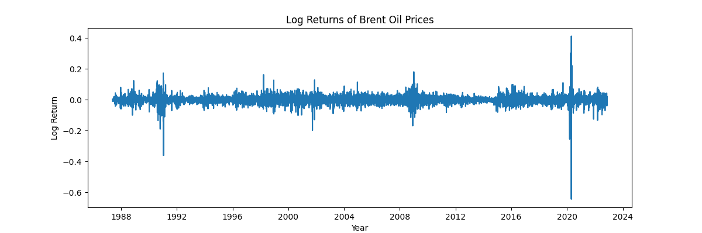

# Exploratory Data Analysis Summary

## Price Dynamics

- Brent oil prices exhibit long-term trends and sharp regime shifts.
- Several abrupt increases and crashes align with known geopolitical and economic events.
- The series does not fluctuate around a constant mean, indicating non-stationarity.

## Log Returns

- Log returns stabilize variance and fluctuate around a near-zero mean.
- Volatility clustering is evident, with calm and turbulent periods.
- This transformation is more suitable for statistical modeling.

## Stationarity Testing
Formal stationarity tests were applied to the raw price series:

- **ADF Test:** Failed to reject the null hypothesis of non-stationarity.
- **KPSS Test:** Rejected the null hypothesis of stationarity.

These results confirm that the raw price series is non-stationary, justifying transformation and change point modeling.

## Key Takeaways
- Brent oil prices show structural breaks and volatility regimes.
- Change point analysis is appropriate for identifying statistically significant shifts.
- Event-based interpretation is required to contextualize detected change points.
